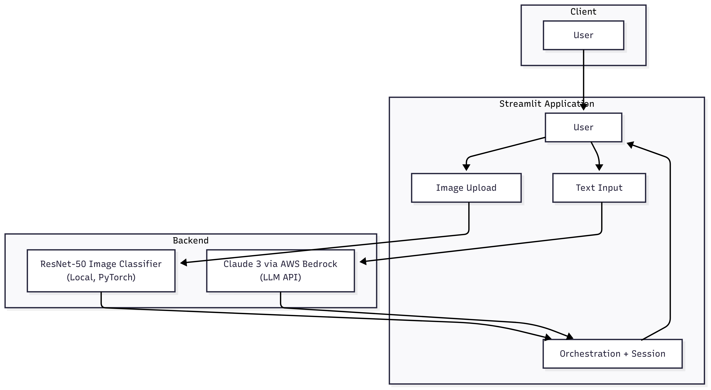

# Multi-Modal AI Service

This project is a **multi-modal AI assistant** that integrates **AWS Bedrock's Claude 3 Sonnet** for language understanding with **PyTorch’s ResNet-50** model for image classification. Built using **Streamlit**, it allows users to upload images and ask natural language questions in a single unified interface.

---
## Demo

 

---

## Architecture Overview



---

## Features

- Upload an image and receive a classification from a pre-trained ResNet-50 model.
- Ask natural language questions to Claude 3 Sonnet via Amazon Bedrock.
- Combined output from vision and language models displayed in a chat-like interface.
- Fully interactive frontend using Streamlit.

---

## Project Structure

```
Multi-Modal_AI_Service/
├── app.py                    # Main Streamlit application
├── .env                      # AWS credentials (not included in repo)
├── requirements.txt          # Python dependencies
├── docs/
│   └── Architecture_MM.png   # Architecture diagram
│   └── performance.md        # Performance documentation
└── README.md                 # Project documentation
```

---

## Getting Started

### 1. Clone the Repository

```bash
git clone https://github.com/Bal67/Multi-Modal_AI_Service.git
cd Multi-Modal_AI_Service
```

### 2. Set Up Your Environment

Create and activate a virtual environment:

```bash
conda create -n multimodal python=3.11
conda activate multimodal
```

Install the required packages:

```bash
pip install -r requirements.txt
```

### 3. Configure AWS Credentials

Create a `.env` file in the root directory:

```env
AWS_ACCESS_KEY_ID=your_access_key
AWS_SECRET_ACCESS_KEY=your_secret_key
AWS_REGION=us-east-1
```

Make sure your AWS user has access to Bedrock and the Anthropic Claude model.

---

## Run the App

Use Streamlit to launch the application:

```bash
streamlit run app.py
```

The app will open in your browser.

---

## Notes

- Image classification uses `torchvision.models.resnet50` pretrained on ImageNet.
- Class labels are dynamically pulled from the official ImageNet source.
- Claude 3 API access requires appropriate permissions in AWS Bedrock.

---

## License

This project is released under the [MIT License](LICENSE).

---

## Author

Developed by Britt Leslie 
GitHub: [Bal67](https://github.com/Bal67)
